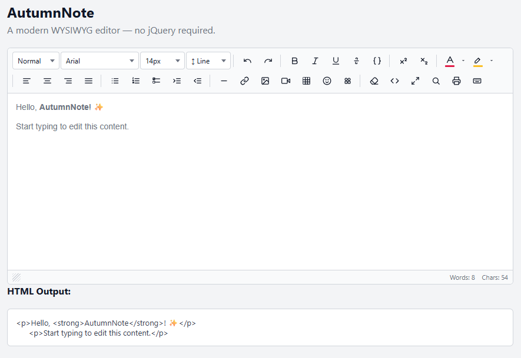

# AutumnNote

[](#)
[](https://developer.mozilla.org/en-US/docs/Web/JavaScript)
[](https://vitejs.dev/)
[](https://vitest.dev/)
[](https://opensource.org/licenses/MIT)
[](#)
[](https://fontawesome.com/)

A modern, lightweight WYSIWYG rich-text editor with vanilla JavaScript (ES2022+), no jQuery dependency.

> ✍️ *Write rich text. No dependencies. No drama.*

🔗 **[Live Demo](https://cmm-cmm.github.io/Autumn-Note/)**



---

## Features

### Editing
- **Text formatting** — bold, italic, underline, strikethrough, superscript, subscript
- **Paragraph styles** — Normal, H1–H6, Blockquote, Code block
- **Font family** — customisable dropdown (10 families by default)
- **Line height** — dropdown from 1.0 to 3.0
- **Text & highlight colour** — native colour picker with last-used colour memory
- **Alignment** — left, center, right, justify
- **Lists** — unordered and ordered, with indent / outdent; Tab/Shift+Tab in list context
- **Undo / redo** — built-in history stack (100 levels, `Ctrl+Z` / `Ctrl+Y`)
- **Tab key** — configurable spaces-per-tab; smart list indentation inside `<li>`

### Insert
- **Horizontal rule** — inserts an `<hr>` at the current caret position
- **Link dialog** — URL, display text (auto-filled from selection), "Open in new tab" checkbox; edits existing links when caret is inside an `<a>`
- **Image dialog** — insert by URL with alt text, or file upload (base64 embed); enforces `maxImageSize`; supports custom `onImageUpload` handler for server-side upload
- **Video dialog** — paste a YouTube watch/short URL, Vimeo URL, or direct `.mp4 / .webm / .ogg` URL; configurable width; renders as responsive `<iframe>` or `<video>`
- **Table** — interactive grid picker (up to 10×10); floating tooltip on table click for full row/column/cell management (see [Table tooltip](#table-tooltip))
- **Emoji picker** — ~380 Unicode emoji across 7 categories (Smileys, People, Animals, Food, Travel, Objects, Symbols); keyword search; click to insert instantly as a plain text character (UTF-8 / utf8mb4 safe)
- **FA Icon picker** — FontAwesome 6 Free Solid icons across 8 categories (Popular, Interface, Navigation, Media, Communication, Files, People, Objects); keyword search; configurable style (Solid / Regular / Light), size, and colour; inserts as `<i>` element; auto-injects FA CDN if not detected on the page

### Inline tooltips
Floating toolbars appear automatically when the user clicks on an editable element:

| Element | Actions |
|---|---|
| **Link** | Open in new tab, Edit (reopens dialog), Unlink |
| **Image** | Edit alt/URL (reopens dialog), Delete |
| **Video** | Edit (reopens dialog), Delete |
| **Table cell** | Row above/below, Delete row, Column left/right, Delete column, Merge cells, Column width, Row height, Delete table |
| **Code block** (`<pre>`) | Copy code, Delete block |

### Context menu
Right-click inside the editor opens a context menu with: **Undo**, **Redo**, **Cut**, **Copy**, **Paste**, **Bold**, **Italic**, **Underline**, **Copy Format**, **Paste Format**, **Remove Format**.

### UI
- **Toolbar** — fully configurable button groups; renders with FontAwesome icons when detected, falls back to inline SVG icons
- **Image resizer** — drag handle on selected image to resize proportionally
- **Video resizer** — drag handle on selected video embed to resize
- **Statusbar** — live word and character count; drag handle to resize editor height
- **Code view** — toggle raw HTML; sanitised before applying back to the editor
- **Fullscreen** — expands the editor to fill the viewport
- **Placeholder** — CSS `::before` pseudo-element, zero DOM node cost

### Integration
- **No jQuery** — pure vanilla ES2022, zero runtime dependencies
- **Bootstrap friendly** — optional Bootstrap 4/5 styling for toolbar buttons (`useBootstrap: true`)
- **FontAwesome ready** — auto-detects FA on the page; falls back to built-in SVG icons
- **Plugin-ready** — register custom modules via `AutumnNote.defaults`
- **Tree-shakeable** — ES module build; all core utilities are individually exported

### Security
- All HTML (pasted content, `setHTML()`, or code-view output) is passed through a DOM-based sanitiser that strips `<script>`, `<iframe>`, `<object>`, `<embed>`, and all `on*` event handler attributes
- `javascript:` and `data:` URLs are rejected in links and images
- Clipboard paste sanitises rich content to remove XSS vectors before inserting

---

## Installation

### npm / pnpm / yarn

```bash
npm install AutumnNote
```

### CDN

```html
<link rel="stylesheet" href="dist/AutumnNote.css" />
<script src="dist/AutumnNote.umd.js"></script>
```

> **FontAwesome icons** — the editor auto-detects FontAwesome on the page and falls back to built-in SVG icons when absent. To enable FA icons, include the FA stylesheet:
>
> ```html
> <!-- FontAwesome 6 Free (recommended) -->
> <link rel="stylesheet" href="https://cdnjs.cloudflare.com/ajax/libs/font-awesome/6.5.2/css/all.min.css">
> ```
>
> If FA is not on the page but the **FA Icon picker** is used, the editor will automatically inject the FontAwesome CDN stylesheet on first open.

---

## Quick Start

### ES Module

```js
import AutumnNote from 'AutumnNote';

const editor = AutumnNote.create('#my-editor', {
  placeholder: 'Start typing…',
  height: 300,
  onChange(html) {
    console.log(html);
  },
});
```

### Script tag (UMD)

```html
<div id="my-editor"><p>Hello!</p></div>
<script src="dist/AutumnNote.umd.js"></script>
<script>
  const editor = AutumnNote.create('#my-editor');
</script>
```

### With Bootstrap 5

```js
const editor = AutumnNote.create('#my-editor', {
  useBootstrap: true,
  bootstrapVersion: 5,
  toolbarButtonClass: 'btn btn-sm btn-light',
});
```

### With FontAwesome 6

```js
const editor = AutumnNote.create('#my-editor', {
  useFontAwesome: true,
  fontAwesomeClass: 'fa-solid',  // FA 6 prefix
});
```

---

## Usage

### Read content on demand

The most common pattern — attach a button that reads back the current HTML:

```html
<link rel="stylesheet" href="dist/autumnnote.css" />

<div id="editor"><p>Hello, <strong>AutumnNote</strong>!</p></div>

<button onclick="getHTML()">Get HTML</button>
<pre id="output"></pre>

<script src="dist/autumnnote.umd.js"></script>
<script>
  const editor = AutumnNote.create('#editor', { height: 300 });

  function getHTML() {
    document.getElementById('output').innerText = editor.getHTML();
  }
</script>
```

### React to every change

Use `onChange` (or `editor.on('change', fn)`) to update a live preview automatically:

```html
<div id="editor"><p>Start typing…</p></div>
<pre id="preview"></pre>

<script src="dist/autumnnote.umd.js"></script>
<script>
  const editor = AutumnNote.create('#editor', {
    height: 300,
    onChange(html) {
      document.getElementById('preview').innerText = html;
    },
  });
</script>
```

### Set and clear content programmatically

```js
editor.setHTML('<p>New <em>content</em></p>'); // set
editor.clear();                                 // clear to empty <p>
console.log(editor.getText());                  // plain text, no markup
```

---

## API

### Factory

| Method | Description |
|---|---|
| `AutumnNote.create(selector, options?)` | Creates editor instance(s). `selector` can be a CSS string, `Element`, `NodeList`, or `Element[]`. Returns a `Context` for a single match, or `Context[]` for multiple. |
| `AutumnNote.destroy(selector)` | Destroys editor(s) matching the selector and restores the original element. |
| `AutumnNote.getInstance(selector)` | Returns the `Context` for a given element, or `null` if not initialised. |
| `AutumnNote.defaults` | Global default options object. Mutate before calling `create()` to apply project-wide settings. |

### Context (editor instance)

| Method | Description |
|---|---|
| `editor.getHTML()` | Returns the current HTML content. Zero-width spaces inserted by the icon picker are stripped automatically. |
| `editor.setHTML(html)` | Sets HTML content. Input is sanitised before rendering. |
| `editor.getText()` | Returns plain text with no markup. |
| `editor.clear()` | Clears all content, resets to an empty `<p>`. |
| `editor.setDisabled(bool)` | Disables (`true`) or re-enables (`false`) the editor and toolbar. |
| `editor.destroy()` | Removes the editor, disposes all modules, and restores the original element. |
| `editor.on(event, fn)` | Subscribes to an editor event. Returns an unsubscribe function — call it to remove the listener. |
| `editor.invoke('module.method', ...args)` | Calls any registered module method by dot-separated name. Returns the method's return value. |

### Events

| Name | Payload | Description |
|---|---|---|
| `change` | `html: string` | Fired after every content mutation. Debounced internally. |
| `focus` | — | Editor's editable area gained focus. |
| `blur` | — | Editor's editable area lost focus. |

#### Subscribing to events

```js
const editor = AutumnNote.create('#editor');

// Subscribe
const unsub = editor.on('change', (html) => {
  document.getElementById('output').innerHTML = html;
});

// Unsubscribe later
unsub();
```

### `invoke()` examples

```js
// Programmatically open a dialog
editor.invoke('linkDialog.show');
editor.invoke('imageDialog.show');
editor.invoke('emojiDialog.show');
editor.invoke('iconDialog.show');

// Undo / redo
editor.invoke('editor.undo');
editor.invoke('editor.redo');

// Toggle views
editor.invoke('codeview.toggle');
editor.invoke('fullscreen.toggle');

// Query state
const isCodeview  = editor.invoke('codeview.isActive');    // boolean
const isFullscreen = editor.invoke('fullscreen.isActive'); // boolean
```

---

## Options

| Option | Type | Default | Description |
|---|---|---|---|
| `placeholder` | `string` | `''` | Placeholder text shown when the editor is empty. |
| `height` | `number` | `200` | Initial / minimum editor height in px. |
| `minHeight` | `number` | `100` | Hard minimum height in px (enforced during resize). |
| `maxHeight` | `number` | `0` | Maximum height in px. `0` = unlimited. |
| `focus` | `boolean` | `false` | Auto-focus the editor on initialisation. |
| `resizeable` | `boolean` | `true` | Show the drag-to-resize handle in the statusbar. |
| `toolbar` | `Array` | default | Array of button group arrays. See [Toolbar customisation](#toolbar-customisation). |
| `useBootstrap` | `boolean` | `false` | Apply Bootstrap button classes to toolbar buttons. |
| `bootstrapVersion` | `number` | `5` | Bootstrap major version to target (`4` or `5`). |
| `toolbarButtonClass` | `string` | `'btn btn-sm btn-light'` | CSS classes applied to toolbar buttons when `useBootstrap` is `true`. |
| `useFontAwesome` | `boolean` | `true` | Render toolbar icons via FontAwesome when FA is detected on the page. |
| `fontAwesomeClass` | `string` | `'fas'` | FontAwesome prefix class. Use `'fas'` for FA 5, `'fa-solid'` for FA 6. |
| `pasteAsPlainText` | `boolean` | `false` | Force all pasted content to plain text, stripping all formatting. |
| `pasteCleanHTML` | `boolean` | `true` | Sanitise HTML on paste — strips scripts and dangerous attributes. |
| `allowImageUpload` | `boolean` | `true` | Show the file upload input in the image dialog. |
| `maxImageSize` | `number` | `5` | Maximum image upload file size in MB. Files exceeding this are rejected with an alert. |
| `onImageUpload` | `Function` | `null` | `(files: FileList) => void` — custom upload handler. When provided, overrides the default base64 embed behaviour. Insert the resulting URL yourself via `editor.invoke('editor.insertImage', url, alt)`. |
| `tabSize` | `number` | `0` | Number of spaces inserted per Tab key press outside of lists. `0` = browser default Tab behaviour. |
| `defaultFontFamily` | `string` | `'Arial'` | Font family applied as the default style for the editable area. |
| `fontFamilies` | `string[]` | (10 fonts) | Font families listed in the Font Family dropdown. Default: Arial, Arial Black, Comic Sans MS, Courier New, Georgia, Impact, Tahoma, Times New Roman, Trebuchet MS, Verdana. |
| `onChange` | `Function` | `null` | `(html: string) => void` — shorthand for `editor.on('change', fn)`. |
| `onFocus` | `Function` | `null` | `(context: Context) => void` — shorthand for `editor.on('focus', fn)`. |
| `onBlur` | `Function` | `null` | `(context: Context) => void` — shorthand for `editor.on('blur', fn)`. |
| `stickyToolbar` | `boolean` | `false` | Stick the toolbar to the viewport top when the page is scrolled. |
| `stickyToolbarOffset` | `number` | `0` | Top offset in px for the sticky toolbar (e.g. height of a fixed navigation bar). |
| `theme` | `string` | `'light'` | Colour theme: `'light'` or `'dark'`. |
| `codeHighlight` | `boolean` | `false` | Auto-load Prism.js for syntax highlighting inside `<pre><code>` blocks. |
| `codeHighlightCDN` | `string` | cdnjs Prism 1.29.0 | Base CDN URL used when auto-loading Prism assets. |
| `markdownPaste` | `boolean` | `true` | Convert pasted Markdown text to HTML when no HTML is present in the clipboard. |

---

## Dialogs

### Link dialog
Fields: **URL** (type=url, required), **Display text** (auto-populated from the current selection), **Open in new tab** checkbox.
When the caret is inside an existing `<a>` element, the dialog pre-fills with the current link's values and updates in-place on confirm.

### Image dialog
Fields: **Image URL** (type=url), **Alt text**, and — when `allowImageUpload` is `true` — a **file picker** (accepts `image/*`). Selecting a file embeds it as a base64 data URI unless `onImageUpload` is provided.

### Video dialog
Fields: **Video URL** (YouTube / Vimeo / direct file), **Width** (px, default 560). Supported URL formats:
- `https://www.youtube.com/watch?v=…` → `<iframe>` embed
- `https://youtu.be/…` → `<iframe>` embed
- `https://vimeo.com/…` → `<iframe>` embed
- Direct `.mp4`, `.webm`, `.ogg` URL → `<video controls>` element

### Emoji picker
Displays ~380 Unicode emoji in a scrollable grid grouped into 7 categories. Filter by category tab or keyword search. Clicking an emoji inserts it immediately as a plain Unicode character — no extra "Insert" step. All characters are UTF-8 / utf8mb4 compatible.

### FA Icon picker
Displays FontAwesome 6 Free Solid icons grouped into 8 categories: **Popular**, **Interface**, **Navigation**, **Media**, **Communication**, **Files**, **People**, **Objects**. Filter by category or keyword search. Before inserting, configure:
- **Style** — Solid, Regular, or Light (Pro)
- **Size** — Inherit, 0.75em, 1em, 1.25em, 1.5em, 2em, 3em
- **Colour** — colour picker + "Use colour" toggle

The icon is inserted as `<i class="fa-solid fa-{name}" style="…">`. If FontAwesome is not loaded on the page, the dialog automatically injects the FA 6 CDN stylesheet on first open.

---

## Table tooltip

Clicking inside any table opens a floating tooltip with the following actions:

| Group | Actions |
|---|---|
| Rows | Add Row Above, Add Row Below, Delete Row |
| Columns | Add Column Left, Add Column Right, Delete Column |
| Cells | Merge Cells |
| Resize | Column Width (px / %), Row Height (px) |
| Danger | Delete Table |

---

## Toolbar Customisation

The `toolbar` option accepts an array of button groups. Each group is a sub-array of button definition objects:

```js
import AutumnNote from 'AutumnNote';
import {
  boldBtn, italicBtn, underlineBtn, strikeBtn,
  foreColorBtn, backColorBtn,
  linkBtn, imageBtn, videoBtn, tableBtn,
  emojiBtn, iconBtn,
  codeviewBtn, fullscreenBtn,
} from 'AutumnNote/src/js/module/Buttons.js';

AutumnNote.create('#editor', {
  toolbar: [
    [boldBtn, italicBtn, underlineBtn, strikeBtn],
    [foreColorBtn, backColorBtn],
    [linkBtn, imageBtn, videoBtn, tableBtn],
    [emojiBtn, iconBtn],
    [codeviewBtn, fullscreenBtn],
  ],
});
```

**Available buttons**

| Export | Type | Tooltip |
|---|---|---|
| `paragraphStyleBtn` | dropdown | Paragraph Style |
| `fontFamilyBtn` | dropdown | Font Family |
| `lineHeightBtn` | dropdown | Line Height |
| `undoBtn` / `redoBtn` | button | Undo / Redo |
| `boldBtn` / `italicBtn` / `underlineBtn` / `strikeBtn` | button | Text style |
| `superscriptBtn` / `subscriptBtn` | button | Super / Subscript |
| `foreColorBtn` / `backColorBtn` | color picker | Text colour / Highlight colour |
| `alignLeftBtn` / `alignCenterBtn` / `alignRightBtn` / `alignJustifyBtn` | button | Alignment |
| `ulBtn` / `olBtn` / `indentBtn` / `outdentBtn` | button | Lists & indentation |
| `hrBtn` | button | Horizontal Rule |
| `linkBtn` | button | Insert Link |
| `imageBtn` | button | Insert Image |
| `videoBtn` | button | Insert Video |
| `tableBtn` | grid picker | Insert Table |
| `emojiBtn` | button | Insert Emoji |
| `iconBtn` | button | Insert FA Icon |
| `codeviewBtn` | button | HTML Code View |
| `fullscreenBtn` | button | Fullscreen |

### Setting global defaults

```js
import AutumnNote from 'AutumnNote';

// Apply once before any create() calls
Object.assign(AutumnNote.defaults, {
  height: 400,
  placeholder: 'Write something…',
  fontAwesomeClass: 'fa-solid',
  fontFamilies: ['Inter', 'Roboto', 'Georgia', 'Courier New'],
});
```

---

## Custom Image Upload

```js
AutumnNote.create('#editor', {
  allowImageUpload: true,
  onImageUpload(files) {
    const formData = new FormData();
    formData.append('file', files[0]);

    fetch('/api/upload', { method: 'POST', body: formData })
      .then(r => r.json())
      .then(({ url }) => {
        // Insert the returned URL into the editor
        this.invoke('editor.insertImage', url, files[0].name);
      });
  },
});
```

---

## Multiple Instances

```js
const editors = AutumnNote.create('.rich-editor', { height: 250 });
// editors is Context[] when selector matches multiple elements

// Iterate all instances
document.querySelectorAll('.rich-editor').forEach((el) => {
  const editor = AutumnNote.getInstance(el);
  console.log(editor.getHTML());
});
```

---

## Project Structure

```
src/
├── js/
│   ├── core/
│   │   ├── dom.js            DOM utilities (createElement, on, closest, …)
│   │   ├── range.js          Selection / Range API helpers (withSavedRange, …)
│   │   ├── func.js           General helpers (mergeDeep, debounce, …)
│   │   ├── key.js            Keyboard key constants
│   │   ├── lists.js          Array helpers
│   │   ├── env.js            Browser / platform detection
│   │   ├── markdown.js       Lightweight Markdown → HTML converter (paste handling)
│   │   └── sanitise.js       DOM-based HTML and URL sanitiser (shared by all modules)
│   ├── editing/
│   │   ├── History.js        Undo / redo stack (100 levels)
│   │   ├── Style.js          execCommand style wrappers
│   │   ├── Table.js          Table creation and cell manipulation
│   │   └── Typing.js         Tab / Enter key behaviour
│   ├── module/
│   │   ├── Editor.js         Core editing commands + getHTML / setHTML + sanitiser
│   │   ├── Toolbar.js        Toolbar UI, button rendering (SVG + FA), dropdowns, colour picker
│   │   ├── Buttons.js        Button / dropdown / colorpicker definitions and defaultToolbar
│   │   ├── Statusbar.js      Word & character count + drag-to-resize
│   │   ├── Clipboard.js      Paste sanitisation (HTML clean + plain-text mode)
│   │   ├── ContextMenu.js    Right-click context menu (cut, copy, paste, format tools)
│   │   ├── Placeholder.js    CSS-based placeholder
│   │   ├── Codeview.js       HTML source view toggle
│   │   ├── Fullscreen.js     Fullscreen mode
│   │   ├── LinkDialog.js     Link insert / edit dialog
│   │   ├── LinkTooltip.js    Floating toolbar for links (open / edit / unlink)
│   │   ├── ImageDialog.js    Image insert dialog (URL + optional file upload)
│   │   ├── ImageTooltip.js   Floating toolbar for images (edit / delete)
│   │   ├── ImageResizer.js   Drag handle to resize images
│   │   ├── VideoDialog.js    Video embed dialog (YouTube, Vimeo, direct file)
│   │   ├── VideoTooltip.js   Floating toolbar for video embeds (edit / delete)
│   │   ├── VideoResizer.js   Drag handle to resize video embeds
│   │   ├── TableTooltip.js   Floating toolbar for tables (row/col/cell management)
│   │   ├── CodeTooltip.js    Floating toolbar for code blocks (copy / delete)
│   │   ├── EmojiDialog.js    Unicode emoji picker (~380 emoji, 7 categories)
│   │   ├── IconDialog.js     FontAwesome icon picker (FA 6 Free Solid, 8 categories)
│   │   └── ShortcutsDialog.js Keyboard shortcuts reference dialog (Shift+?)
│   ├── Context.js            Editor instance hub — module registry and event bus
│   ├── settings.js           Default options (AsnOptions)
│   ├── renderer.js           DOM layout builder
│   └── index.js              Public entry point + AutumnNote factory
└── styles/
    ├── _variables.scss       SCSS design tokens (colours, spacing, radii, transitions)
    └── AutumnNote.scss  Main stylesheet
```

---

## Development

```bash
# Install dependencies
npm install

# Start dev server with HMR (Vite)
npm run dev

# Build library (ES module + UMD + CSS)
npm run build

# Run unit tests (Vitest)
npm test
```

Build output in `dist/`:
- `AutumnNote.es.js` — ES module (tree-shakeable)
- `AutumnNote.umd.js` — UMD bundle (script tag / CommonJS)
- `AutumnNote.css` — compiled stylesheet

---

## Comparison with Summernote

| Feature | Summernote | AutumnNote |
|---|---|---|
| jQuery required | Yes | No |
| Bootstrap required | Optional | No |
| Build system | Grunt | Vite |
| Module format | IIFE | ES module + UMD |
| Written in | ES5 / ES6 mix | ES2022 |
| HTML sanitisation | Basic | DOM-based (strips scripts, XSS vectors) |
| Emoji picker | No | Yes (~380 Unicode emoji, 7 categories) |
| FA icon picker | No | Yes (FA 6 Free Solid, 8 categories, searchable) |
| Video embeds | No | Yes (YouTube, Vimeo, direct file) |
| Image / video resize | No | Yes (drag handles) |
| Inline tooltips | No | Yes (link, image, video, table, code) |
| Context menu | No | Yes (with format copy/paste) |
| Right-click context menu | No | Yes |

---

## License

MIT

---

## Features

### Editing
- **Text formatting** — bold, italic, underline, strikethrough, superscript, subscript
- **Paragraph styles** — Normal, H1–H6, Blockquote, Code block
- **Font family** — customisable dropdown (10 families by default)
- **Line height** — dropdown from 1.0 to 3.0
- **Text & highlight colour** — native colour picker with last-used colour
- **Alignment** — left, center, right, justify
- **Lists** — unordered and ordered, with indent / outdent
- **Undo / redo** — built-in history stack (100 levels, `Ctrl+Z` / `Ctrl+Y`)
- **Tab key** — configurable spaces-per-tab, smart list indentation

### Insert
- **Horizontal rule**
- **Link dialog** — insert / edit hyperlinks with text and target options
- **Image dialog** — insert by URL or file upload (base64 embed); configurable max size
- **Video dialog** — insert YouTube / Vimeo / direct video URLs as responsive embeds
- **Table** — interactive grid picker (up to 10×10), context-menu actions (add/delete row/col, merge, split)
- **Emoji picker** — ~380 Unicode emoji across 7 categories (Smileys, People, Animals, Food, Travel, Objects, Symbols) with keyword search; click to insert instantly
- **FA Icon picker** — browse FontAwesome 6 Free Solid icons by category with keyword search; configurable style, size, and colour

### UI
- **Toolbar** — fully configurable button groups; auto-renders with SVG fallback or FontAwesome icons
- **Inline tooltips** — link, image, video, table, and code-block context tooltips with edit/delete actions
- **Image resizer** — drag handle to resize inserted images
- **Video resizer** — drag handle to resize inserted video embeds
- **Statusbar** — word and character count + drag-to-resize editor height
- **Code view** — toggle raw HTML source editor with sanitisation on apply
- **Fullscreen** — expand to fill the viewport
- **Placeholder** — CSS-based, zero DOM pollution
- **Context menu** — right-click menu for common actions

### Integration
- **No jQuery** — pure vanilla ES2022, zero runtime dependencies
- **Bootstrap friendly** — optional Bootstrap 4/5 styling for toolbar buttons (`useBootstrap: true`)
- **FontAwesome ready** — auto-detects FA on the page; falls back to inline SVG icons
- **Plugin-ready** — register custom modules via `AutumnNote.defaults`
- **Tree-shakeable** — ES module build; all core utilities are individually exported

### Security
- All HTML (pasted, loaded via `setHTML`, or applied from code view) is sanitised through a DOM-based parser — strips `<script>`, `<iframe>`, `<object>`, all `on*` attributes
- `javascript:` URLs are rejected in links and images
- Clipboard paste sanitises and removes XSS vectors before inserting

---

## Installation

### npm / pnpm / yarn

```bash
npm install AutumnNote
```

### CDN

```html
<link rel="stylesheet" href="dist/AutumnNote.css" />
<script src="dist/AutumnNote.umd.js"></script>
```

> To use FontAwesome toolbar icons, include the FA stylesheet on your page. The editor auto-detects it and falls back to built-in SVG icons when FA is absent.
>
> ```html
> <!-- FontAwesome 6 Free -->
> <link rel="stylesheet" href="https://cdnjs.cloudflare.com/ajax/libs/font-awesome/6.5.2/css/all.min.css">
> ```

---

## Quick Start

### ES Module

```js
import AutumnNote from 'AutumnNote';

const editor = AutumnNote.create('#my-editor', {
  placeholder: 'Start typing…',
  height: 300,
  onChange(html) {
    console.log(html);
  },
});
```

### Script tag (UMD)

```html
<div id="my-editor"><p>Hello!</p></div>
<script src="dist/AutumnNote.umd.js"></script>
<script>
  const editor = AutumnNote.create('#my-editor');
</script>
```

### With Bootstrap 5

```js
const editor = AutumnNote.create('#my-editor', {
  useBootstrap: true,
  bootstrapVersion: 5,
  toolbarButtonClass: 'btn btn-sm btn-light',
});
```

---

## API

### Factory

| Method | Description |
|---|---|
| `AutumnNote.create(selector, options?)` | Creates editor instance(s). Returns a `Context` (or array of `Context`). |
| `AutumnNote.destroy(selector)` | Destroys editor(s) and restores the original element. |
| `AutumnNote.getInstance(selector)` | Returns the `Context` for a given element, or `null`. |
| `AutumnNote.defaults` | Global default options — mutate before calling `create()` to set project-wide defaults. |

### Context (editor instance)

| Method | Description |
|---|---|
| `editor.getHTML()` | Returns the current HTML content (sanitised). |
| `editor.setHTML(html)` | Sets HTML content (sanitised). |
| `editor.getText()` | Returns plain text (no markup). |
| `editor.clear()` | Clears all content. |
| `editor.setDisabled(bool)` | Enables or disables the editor. |
| `editor.destroy()` | Removes the editor and restores the original element. |
| `editor.on(event, fn)` | Subscribes to an editor event. Returns an unsubscribe function. |
| `editor.invoke('module.method', ...args)` | Calls any registered module method by name. |

### Events

| Name | Payload | Description |
|---|---|---|
| `change` | `html: string` | Fired after every content mutation. |
| `focus` | — | Editor gained focus. |
| `blur` | — | Editor lost focus. |

---

## Options

| Option | Type | Default | Description |
|---|---|---|---|
| `placeholder` | `string` | `''` | Placeholder text shown when the editor is empty. |
| `height` | `number` | `200` | Initial / minimum editor height in px. |
| `minHeight` | `number` | `100` | Hard minimum height in px. |
| `maxHeight` | `number` | `0` | Maximum height in px. `0` = unlimited. |
| `focus` | `boolean` | `false` | Auto-focus the editor on initialisation. |
| `resizeable` | `boolean` | `true` | Show the drag-to-resize handle in the statusbar. |
| `toolbar` | `Array` | default | Array of button group arrays. See [Toolbar customisation](#toolbar-customisation). |
| `useBootstrap` | `boolean` | `false` | Apply Bootstrap classes to toolbar buttons. |
| `bootstrapVersion` | `number` | `5` | Bootstrap major version (`4` or `5`). |
| `toolbarButtonClass` | `string` | `'btn btn-sm btn-light'` | CSS classes for toolbar buttons when `useBootstrap` is `true`. |
| `useFontAwesome` | `boolean` | `true` | Use FA icons when FontAwesome is detected on the page. |
| `fontAwesomeClass` | `string` | `'fas'` | FA prefix — `'fas'` for FA 5, `'fa-solid'` for FA 6. |
| `pasteAsPlainText` | `boolean` | `false` | Strip all formatting on paste. |
| `pasteCleanHTML` | `boolean` | `true` | Sanitise HTML on paste. |
| `allowImageUpload` | `boolean` | `true` | Allow file upload in the image dialog. |
| `maxImageSize` | `number` | `5` | Maximum image upload size in MB. |
| `onImageUpload` | `Function` | `null` | Custom upload handler `(files: FileList) => void`. Overrides base64 embed. |
| `tabSize` | `number` | `0` | Spaces inserted per Tab key press. `0` = browser default. |
| `defaultFontFamily` | `string` | `'Arial'` | Font applied to the editable area. |
| `fontFamilies` | `string[]` | (10 fonts) | Font families listed in the font-family dropdown. |
| `onChange` | `Function` | `null` | `(html: string) => void` — called on every change. |
| `onFocus` | `Function` | `null` | `(context: Context) => void` |
| `onBlur` | `Function` | `null` | `(context: Context) => void` |
| `stickyToolbar` | `boolean` | `false` | Stick the toolbar to the viewport top when the page is scrolled. |
| `stickyToolbarOffset` | `number` | `0` | Top offset in px for the sticky toolbar (e.g. height of a fixed navigation bar). |
| `theme` | `string` | `'light'` | Colour theme: `'light'` or `'dark'`. |
| `codeHighlight` | `boolean` | `false` | Auto-load Prism.js for syntax highlighting inside `<pre><code>` blocks. |
| `codeHighlightCDN` | `string` | cdnjs Prism 1.29.0 | Base CDN URL used when auto-loading Prism assets. |
| `markdownPaste` | `boolean` | `true` | Convert pasted Markdown text to HTML when no HTML is present in the clipboard. |

---

## Toolbar Customisation

The `toolbar` option accepts an array of button groups. Each group is an array of button definition objects imported from `Buttons.js`:

```js
import AutumnNote from 'AutumnNote';
import {
  boldBtn, italicBtn, underlineBtn,
  linkBtn, imageBtn, emojiBtn, iconBtn,
  codeviewBtn, fullscreenBtn,
} from 'AutumnNote/src/js/module/Buttons.js';

AutumnNote.create('#editor', {
  toolbar: [
    [boldBtn, italicBtn, underlineBtn],
    [linkBtn, imageBtn, emojiBtn, iconBtn],
    [codeviewBtn, fullscreenBtn],
  ],
});
```

**Available buttons**

| Export | Tooltip |
|---|---|
| `paragraphStyleBtn` | Paragraph Style (dropdown) |
| `fontFamilyBtn` | Font Family (dropdown) |
| `lineHeightBtn` | Line Height (dropdown) |
| `undoBtn` / `redoBtn` | Undo / Redo |
| `boldBtn` / `italicBtn` / `underlineBtn` / `strikeBtn` | Text style |
| `superscriptBtn` / `subscriptBtn` | Super / Subscript |
| `foreColorBtn` / `backColorBtn` | Text colour / Highlight colour |
| `alignLeftBtn` / `alignCenterBtn` / `alignRightBtn` / `alignJustifyBtn` | Alignment |
| `ulBtn` / `olBtn` / `indentBtn` / `outdentBtn` | Lists & indentation |
| `hrBtn` | Horizontal Rule |
| `linkBtn` | Insert Link |
| `imageBtn` | Insert Image |
| `videoBtn` | Insert Video |
| `tableBtn` | Insert Table (grid picker) |
| `emojiBtn` | Insert Emoji |
| `iconBtn` | Insert FA Icon |
| `codeviewBtn` | HTML Code View |
| `fullscreenBtn` | Fullscreen |

---

## Project Structure

```
src/
├── js/
│   ├── core/
│   │   ├── dom.js            DOM utilities
│   │   ├── range.js          Selection / Range API helpers
│   │   ├── func.js           General utility helpers
│   │   ├── key.js            Keyboard key constants
│   │   ├── lists.js          Array helpers
│   │   ├── env.js            Browser / platform detection
│   │   ├── markdown.js       Markdown → HTML converter
│   │   └── sanitise.js       DOM-based HTML and URL sanitiser
│   ├── editing/
│   │   ├── History.js        Undo / redo stack
│   │   ├── Style.js          execCommand style wrappers
│   │   ├── Table.js          Table creation and manipulation
│   │   └── Typing.js         Tab / Enter key behaviour
│   ├── module/
│   │   ├── Editor.js         Core editing commands + getHTML / setHTML
│   │   ├── Toolbar.js        Toolbar UI and button rendering
│   │   ├── Buttons.js        Button and dropdown definitions
│   │   ├── Statusbar.js      Status bar + drag-to-resize
│   │   ├── Clipboard.js      Paste sanitisation
│   │   ├── ContextMenu.js    Right-click context menu
│   │   ├── Placeholder.js    Placeholder text
│   │   ├── Codeview.js       HTML source view
│   │   ├── Fullscreen.js     Fullscreen mode
│   │   ├── LinkDialog.js     Link insert / edit dialog
│   │   ├── LinkTooltip.js    Inline link tooltip
│   │   ├── ImageDialog.js    Image insert dialog (URL + upload)
│   │   ├── ImageTooltip.js   Inline image tooltip
│   │   ├── ImageResizer.js   Drag-to-resize for images
│   │   ├── VideoDialog.js    Video embed dialog
│   │   ├── VideoTooltip.js   Inline video tooltip
│   │   ├── VideoResizer.js   Drag-to-resize for video embeds
│   │   ├── TableTooltip.js   Table context tooltip
│   │   ├── CodeTooltip.js    Code block context tooltip
│   │   ├── EmojiDialog.js    Unicode emoji picker
│   │   ├── IconDialog.js     FontAwesome icon picker
│   │   └── ShortcutsDialog.js Keyboard shortcuts dialog
│   ├── Context.js            Editor instance hub
│   ├── settings.js           Default options
│   ├── renderer.js           DOM layout builder
│   └── index.js              Public entry point
└── styles/
    ├── _variables.scss       SCSS design tokens
    └── AutumnNote.scss  Main stylesheet
```

---

## Development

```bash
# Install dependencies
npm install

# Start dev server (Vite)
npm run dev

# Build library
npm run build

# Run tests
npm test
```

---

## Comparison with Summernote

| Feature | Summernote | AutumnNote |
|---|---|---|
| jQuery required | Yes | No |
| Bootstrap required | Optional | No |
| Build system | Grunt | Vite |
| Module format | IIFE | ES module + UMD |
| Written in | ES5 / ES6 mix | ES2022 |
| HTML sanitisation | Basic | DOM-based (strips scripts, XSS vectors) |
| Emoji picker | No | Yes (~380 Unicode emoji) |
| FA icon picker | No | Yes (FA 6 Free Solid, searchable) |
| Video embeds | No | Yes (YouTube, Vimeo, direct) |
| Image / video resize | No | Yes (drag handles) |
| Inline tooltips | No | Yes (link, image, video, table, code) |

---

## License

MIT
