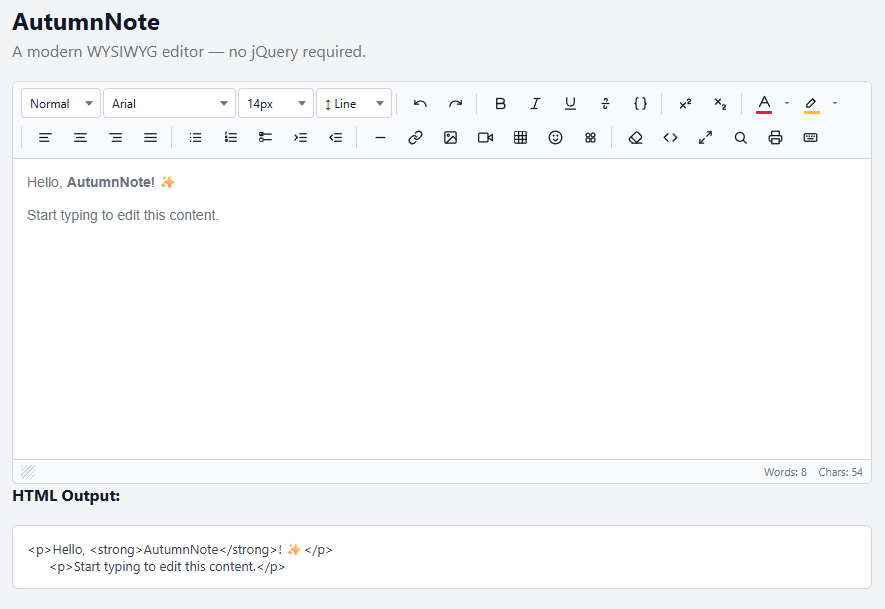

# Autumn Note — WYSIWYG Rich Text Editor

<p align="center"></p>

[](https://www.npmjs.com/package/autumnnote)
[](https://www.npmjs.com/package/autumnnote)
[](https://bundlephobia.com/package/autumnnote)
[](https://github.com/cmm-cmm/Autumn-Note)
[](https://github.com/cmm-cmm/Autumn-Note/actions/workflows/ci.yml)
[](https://developer.mozilla.org/en-US/docs/Web/JavaScript)
[](https://opensource.org/licenses/MIT)
[](#)
[](types/index.d.ts)
[](https://www.npmjs.com/package/autumnnote#provenance)

A **zero-dependency WYSIWYG rich-text editor** built with vanilla JavaScript (ES2022+) — no jQuery, no runtime dependencies. Lightweight alternative to Summernote, Quill, TinyMCE, Froala, CKEditor, ProseMirror, Trix, and Slate — with official React and Vue 3 wrappers.

> **Fast. Lightweight. Reliable. Efficient.**

[Live Demo](https://autumn.konexforge.com/) · [Docs](https://autumn.konexforge.com/docs.html) · [Playground](https://autumn.konexforge.com/playground.html)

<p align="center"></p>

---

## Table of Contents

1. [Features](#features)
2. [Installation](#installation)
3. [Minimal build](#minimal-build)
4. [Framework Wrappers](#framework-wrappers)
5. [Quick Start](#quick-start)
6. [Plugin API](#plugin-api)
7. [API](#api)
8. [Options](#options)
9. [Toolbar Customisation](#toolbar-customisation)
10. [Keyboard Shortcuts](#keyboard-shortcuts)
11. [Mentions](#mentions)
12. [Project Structure](#project-structure)
13. [Comparison](#comparison)
14. [License](#license)

---

## Features

### Editing
- **Text formatting** — bold, italic, underline, strikethrough, superscript, subscript
- **Paragraph styles** — Normal, H1–H6, Blockquote, Code block
- **Font family** — customisable dropdown (10 families by default)
- **Font size** — configurable default via `defaultFontSize`; applied to new content
- **Line height** — dropdown from 1.0 to 3.0
- **Text and highlight colour** — native colour picker with last-used colour memory; custom brand swatches via `colorSwatches`
- **Alignment** — left, center, right, justify
- **Lists** — unordered and ordered, with indent / outdent; Tab/Shift+Tab in list context
- **Checklist** — interactive checkbox list; toggle items by clicking; converts to/from plain paragraphs on outdent
- **Undo / redo** — built-in history stack (configurable depth via `historyLimit`, `Ctrl+Z` / `Ctrl+Y`)
- **Tab key** — configurable spaces-per-tab; smart list indentation inside `<li>`
- **RTL support** — set `direction: 'rtl'` to flip the editor layout and text direction

### Insert
- **Horizontal rule** — inserts an `<hr>` at the current caret position
- **Link dialog** — URL, display text (auto-filled from selection), "Open in new tab" checkbox; edits existing links when caret is inside an `<a>`
- **Image dialog** — insert by URL with alt text, or file upload (base64 embed); enforces `maxImageSize`; file input restricted to browser-renderable MIME types
- **Server-side image upload** — return the uploaded URL from `onImageUpload` (or a promise of it) and the editor drops in a dimmed placeholder previewing the local file straight away, then swaps in the real URL when it lands. Report progress with the supplied `setProgress(file, ratio)`; a rejection marks the image failed and fires `imageError` with a `retry()` for that file. A handler that returns nothing keeps the previous behaviour and inserts the image itself:

  ```js
  AutumnNote.create('#editor', {
    async onImageUpload(files, { setProgress }) {
      return Promise.all(files.map(async (file) => {
        const body = new FormData();
        body.append('file', file);
        setProgress(file, 0.1);
        const res = await fetch('/api/upload', { method: 'POST', body });
        setProgress(file, 1);
        return (await res.json()).url;   // inserted in place of the placeholder
      }));
    },
  });
  ```
- **Image crop overlay** — inline interactive crop tool triggered from the image tooltip; corner and edge drag handles; canvas-based crop export; CORS fallback warning
- **Video dialog** — paste a YouTube watch/short URL, Vimeo URL, or direct `.mp4 / .webm / .ogg` URL; configurable width; renders as responsive `<iframe>` or `<video>`
- **Table** — interactive grid picker (up to 10x10); optional header row (`tableHeaderRow`); floating tooltip for full row/column/cell management
- **Emoji picker** — approximately 380 Unicode emoji across 7 categories (Smileys, People, Animals, Food, Travel, Objects, Symbols); keyword search; click to insert as plain UTF-8 character
- **FA Icon picker** — FontAwesome 6 Free Solid icons across 8 categories; keyword search; configurable style, size, and colour; inserts as `<i>` element; auto-injects FA CDN if not on the page

### Search
- **Find and Replace** — `Ctrl+F` to find, `Ctrl+H` for find-and-replace; compact non-blocking floating panel (top-right); TreeWalker text matching; `<mark>` highlighting; case-sensitive `Aa` toggle; **regex mode** (`.*` toggle); icon-button Prev/Next navigation (↑ ↓); single and replace-all modes
- **Auto language detection** — when selected text is formatted as a code block the editor analyses the content and applies Prism.js syntax highlighting. 22 languages: JavaScript, TypeScript, Python, HTML, CSS, SCSS, JSON, YAML, Markdown, XML, SQL, Bash, Java, C#, PHP, Ruby, Go, Rust, C++, C, Kotlin, Swift. Detection weighs every matching signal and picks the highest-scoring language, requiring a clear margin before it commits — a snippet that could be two things is left unhighlighted rather than guessed at, and prose is never treated as code

### Inline tooltips
Floating toolbars appear automatically when the user clicks on an editable element:

| Element | Actions |
|---|---|
| **Link** | Open in new tab, Edit (reopens dialog), Unlink |
| **Image** | Edit alt/URL (reopens dialog), Crop, Delete |
| **Video** | Edit (reopens dialog), Delete |
| **Table cell** | Row above/below, Delete row, Column left/right, Delete column, Merge cells, Unmerge cells, Cell selection mode, Column width, Row height, Border width/color, **Cell background colour**, **Cell padding**, **Sort ↑↓**, **Export CSV**, **Toggle header row**, Delete table |
| **Code block** | Copy code, Language selector (20 languages + SCSS), **Line numbers toggle**, Delete block |

### Context menu
Right-click inside the editor opens a context menu with: **Undo**, **Redo**, **Cut**, **Copy**, **Paste**, **Bold**, **Italic**, **Underline**, **Copy Format**, **Paste Format**, **Remove Format**, and a **colour palette** for quick text/highlight colour changes.

### Internationalisation
- **Built-in locales** — English (`en`), Vietnamese (`vi`), Japanese (`ja`), Simplified Chinese (`zh`), French (`fr`), German (`de`), Spanish (`es`), Korean (`ko`)
- **Custom locale** — pass any partial locale object to override individual strings
- **Per-instance language** — set a different `lang` per editor instance on the same page
- **Auto-fallback** — unknown codes or missing keys fall back to English

### UI
- **Toolbar** — fully configurable button groups; overflow strategy: `wrap` (default) or `scroll`; on viewports ≤ 640 px the toolbar automatically switches to a single horizontally-scrollable row regardless of the `toolbarOverflow` setting; FontAwesome icons with built-in SVG fallback
- **Sticky toolbar** — `stickyToolbar: true` pins the toolbar to the viewport top; configurable offset for fixed nav bars
- **Dark / light / auto theme** — `theme: 'dark'`, `'light'` (default), or `'auto'` (follows OS `prefers-color-scheme`); full SCSS variable coverage; dark styles propagate to all floating elements (dialogs, tooltips, colour pickers)
- **Draggable dialogs** — all dialogs (Link, Image, Video, Emoji, Icon, Find & Replace) can be repositioned by dragging their title bar; position is clamped to the viewport
- **Image resizer** — drag handle on selected image to resize proportionally
- **Video resizer** — drag handle on selected video embed to resize
- **Statusbar** — live word and character count; drag handle to resize editor height; limit warnings when `maxChars` or `maxWords` is reached
- **Code view** — toggle raw HTML; sanitised before applying back to the editor
- **Fullscreen** — expands the editor to fill the viewport
- **Placeholder** — CSS `::before` pseudo-element, zero DOM node cost
- **Read-only mode** — `readOnly: true` renders a non-editable preview with toolbar hidden; toggle at runtime via `editor.setDisabled()`
- **Auto-save** — `autoSave: true` persists content to `localStorage` on every change; key configurable via `autoSaveKey`
- **Auto-save restore** — when `autoSave` and `autoSaveRestore` are both `true`, a dismissible banner prompts the user to restore or discard a previously saved draft on load; configurable age window via `autoSaveRestoreTimeout`
- **Bubble toolbar** — `bubbleToolbar: true` shows a compact floating toolbar above selected text; default buttons: bold, italic, underline, strikethrough, link, **text colour**, **highlight colour**, remove format, inline code; each colour button displays a live colour-strip indicator and opens an inline colour palette (matching the context menu); button set configurable via `bubbleToolbarItems`
- **Markdown shortcuts** — `markdownShortcuts: true` (default) converts Markdown syntax typed in the editor into HTML in real time: `# `–`###### ` → H1–H6, `> ` → blockquote, `- ` / `* ` / `+ ` → unordered list, `1. ` / `1) ` → ordered list, `[ ] ` / `[x] ` → checklist, `---` / `***` / `___` → HR, ` ``` ` / `~~~` → code block; inline: `**bold**`, `*italic*`, `~~strikethrough~~`, `` `code` ``. Rules are suppressed inside code blocks and code spans, where Markdown syntax is literal text
- **Markdown conversion** — `getMarkdown()` / `setMarkdown()` / `downloadMarkdown()` and `.md` file drop go through a CommonMark-leaning converter: fenced (` ``` ` and `~~~`, any fence length, indented) and 4-space indented code blocks, link and image titles, angle-bracket destinations, reference links, footnotes, GFM tables with or without outer pipes and with column alignment, task lists, character references, and a UTF-8 BOM. Markdown syntax appearing in ordinary prose is escaped on the way out, so text round-trips as text
- **Custom focus ring** — `focusColor` accepts any CSS colour string to override the default blue focus ring
- **Spellcheck** — browser spellcheck enabled by default (`spellcheck: true`)

### Integration
- **No jQuery** — pure vanilla ES2022, zero runtime dependencies
- **Bootstrap friendly** — optional Bootstrap 4/5 styling (`useBootstrap: true`)
- **FontAwesome ready** — auto-detects FA on the page; falls back to built-in SVG icons
- **Plugin API** — first-class plugin system: `AutumnNote.use(plugin)`, `context.getPlugin(name)`, global button registry (`registerButton`), per-instance installation, `AsnPlugin<T>` TypeScript interface
- **Tree-shakeable** — ES module build; all core utilities individually exported
- **TypeScript definitions** — bundled `types/index.d.ts` with full JSDoc coverage
- **@mention autocomplete** — type `@` (or any custom trigger) to open a floating dropdown backed by a user-supplied `onSearch` function (callback or `async`/Promise); inserts a non-editable mention chip; customisable chip HTML via `onInsert`

### Accessibility
- **Toolbar is a single tab stop** — it carries `role="toolbar"` and a roving tabindex, so keyboard users reach the text area with one Tab instead of stepping through every button. Left/Right move between controls and wrap at the ends, Home/End jump to the extremes, and the arrows reverse under `direction: 'rtl'`. Up/Down are left to `<select>` controls so they keep native value changing
- **Toggle state is announced** — buttons that track an active state (bold, italic, …) expose `aria-pressed`, not just a CSS class
- **Labelled controls** — every toolbar button carries a localised `aria-label`; the editable area is a `role="textbox"` with `aria-multiline`
- **Dialogs trap focus** — Tab and Shift+Tab cycle inside the open dialog, Escape closes it
- **Touch support** — image and video resize handles are driven by pointer events, so they work with mouse, touch and pen; handles get an enlarged transparent hit area

### Security
- All HTML (pasted content, `setHTML()`, or code-view output) passes through a DOM-based sanitiser that strips `<script>`, `<object>`, `<embed>`, and all `on*` event handler attributes
- **SVG animation elements are removed** (`<animate>`, `<set>`, `<animateTransform>`, `<animateMotion>`) — they can rewrite an attribute *after* sanitisation finishes, which otherwise lets `<svg><a><animate attributeName="href" values="javascript:…">` survive an attribute-level filter and still navigate on click
- **MathML HTML-integration points are removed** (`<mglyph>`, `<malignmark>`, `<annotation-xml>`) — they make the parser switch namespaces mid-tree, so a crafted fragment could re-parse into different markup than it serialised from (mXSS). Sanitising is a fixed point; ordinary formula markup is untouched
- `<iframe>` elements are permitted in `setHTML()` with src restricted to trusted CDN hosts; `srcdoc` is stripped
- Links use an HTTP(S)/`mailto:`/`tel:` allowlist; images additionally allow approved raster data URIs, while SVG data URIs are rejected
- **Every URL-bearing attribute is filtered**, not just `href`/`src`: `poster`, `background` and `srcset` are validated against the media allowlist (`srcset` candidate by candidate), and `ping` is stripped outright since its only effect is an outbound beacon
- **Inline styles are allowlisted by property**, and any value calling `url()`, `image-set()`, `src()`, `expression()` or `@import` is dropped so pasted content cannot phone home
- Clipboard paste sanitises rich content to remove XSS vectors before inserting
- `pasteStripAttributes` option strips `class`, `style`, and `data-*` from pasted HTML

Found a vulnerability? Please follow [SECURITY.md](SECURITY.md) rather than opening a public issue.

### Server-side rendering
The package is safe to `import` in a Node/SSR context — no module reads `document`, `window` or `navigator` at import time, so the React and Vue wrappers work under Next.js and Nuxt. Editors are only created when you call `create()` in the browser.

---

## Installation

### npm / pnpm / yarn

```bash
npm install autumnnote
```

```js
import AutumnNote from 'autumnnote';
import 'autumnnote/dist/autumnnote.css';
```

### CDN

**jsDelivr** (Recommended):

```html
<script src="https://cdn.jsdelivr.net/npm/autumnnote"></script>
```

**unpkg:**

```html
<script src="https://unpkg.com/autumnnote"></script>
```


```html
<link rel="stylesheet" href="dist/autumnnote.css" />
<script src="dist/autumnnote.umd.js"></script>
```

> **FontAwesome icons** — the editor auto-detects FontAwesome on the page and falls back to built-in SVG icons when absent. To enable FA icons, include the FA stylesheet:
>
> ```html
> <!-- FontAwesome 6 Free (recommended) -->
> <link rel="stylesheet" href="https://cdnjs.cloudflare.com/ajax/libs/font-awesome/6.5.2/css/all.min.css">
> ```

---

## Minimal build

The default entry installs every module. When you only need basic formatting,
import `autumnnote/core` instead — it leaves the dialogs, floating tooltips,
emoji and icon pickers and the crop overlay out of the bundle entirely rather
than shipping them switched off:

```js
import AutumnNote from 'autumnnote/core';
import 'autumnnote/dist/autumnnote.css';   // same stylesheet as the full build

AutumnNote.create('#editor', {
  toolbar: [['bold', 'italic', 'underline'], ['ul', 'ol'], ['undo', 'redo']],
});
```

| Entry | Modules | ES bundle (gzip) |
|---|---|---|
| `autumnnote` | all | 84.1 KiB |
| `autumnnote/core` | editor, toolbar, statusbar, clipboard, placeholder | **44.2 KiB** |

Same API, same types, same stylesheet — the difference is only which modules are
installed. A toolbar button whose module is absent still renders, but invoking it
logs a warning and does nothing, so give this preset a toolbar naming only
buttons the core modules serve.

---

## Framework Wrappers

Official React and Vue 3 wrappers are available as separate packages in this monorepo (managed with pnpm workspaces).

### React

```bash
npm install autumnnote autumnnote-react
```

```js
import 'autumnnote/dist/autumnnote.css';
```

```jsx
import { useRef } from 'react';
import AutumnNoteEditor from 'autumnnote-react';

function MyEditor() {
  const editorRef = useRef(null);

  return (
    <AutumnNoteEditor
      ref={editorRef}
      options={{ placeholder: 'Start typing…', height: 300, bubbleToolbar: true }}
    />
  );
}

// Access the editor instance:
editorRef.current.getHTML();
editorRef.current.invoke('editor.setHTML', '<p>Hello!</p>');
```

The `ref` is forwarded to the underlying `Context` instance via `useImperativeHandle`. Pass a `key` prop to force remount when options change.

### Vue 3

```bash
npm install autumnnote autumnnote-vue
```

```js
import 'autumnnote/dist/autumnnote.css';
```

```vue
<script setup>
import { ref } from 'vue';
import AutumnNoteEditor from 'autumnnote-vue';

const editorRef = ref(null);
</script>

<template>
  <AutumnNoteEditor
    ref="editorRef"
    :options="{ placeholder: 'Start typing…', height: 300 }"
  />
</template>
```

Access the editor instance via `editorRef.value.editor`; Vue unwraps the component's internal shallow ref.

---

## Quick Start

### ES Module

```js
import AutumnNote from 'autumnnote';

const editor = AutumnNote.create('#my-editor', {
  placeholder: 'Start typing…',
  height: 300,
  onChange(html) {
    console.log(html);
  },
});
```

### Script tag (UMD)

```html
<div id="my-editor"><p>Hello!</p></div>
<script src="dist/autumnnote.umd.js"></script>
<script>
  const editor = AutumnNote.create('#my-editor');
</script>
```

### With Bootstrap 5

```js
const editor = AutumnNote.create('#my-editor', {
  useBootstrap: true,
  toolbarButtonClass: 'btn btn-sm btn-light',
});
```

### Dark mode

```js
const editor = AutumnNote.create('#my-editor', { theme: 'dark' });
```

### Read-only preview

```js
const preview = AutumnNote.create('#preview', { readOnly: true });
preview.setHTML(savedHtml);
```

### Auto-save draft

```js
const editor = AutumnNote.create('#my-editor', {
  autoSave: true,
  autoSaveKey: 'my-draft',
});
```

### Custom image upload

Return the URL and the editor places the image for you — a placeholder appears
at the caret immediately and is replaced when the upload resolves:

```js
AutumnNote.create('#my-editor', {
  async onImageUpload(files, { setProgress }) {
    return Promise.all(files.map(async (file) => {
      const fd = new FormData();
      fd.append('file', file);
      setProgress(file, 0.1);
      const res = await fetch('/api/upload', { method: 'POST', body: fd });
      setProgress(file, 1);
      return (await res.json()).url;
    }));
  },
  onImageError({ file, message, retry }) {
    console.warn(message, file?.name);
    retry?.();          // re-sends just that file
  },
});
```

Returning nothing keeps the original behaviour — the handler inserts the image
itself and no placeholder is shown:

```js
const editor = AutumnNote.create('#my-editor', {
  onImageUpload(files) {
    upload(files[0]).then(({ url }) =>
      editor.invoke('editor.insertImage', url, files[0].name));
  },
});
```

> `onImageUpload` **uploads** and resolves to any URL the sanitiser accepts.
> `imageProcessor` **transforms** a file and must resolve to a data URL — use it
> for compression or format conversion, not for sending the file somewhere.

### Bubble toolbar

```js
const editor = AutumnNote.create('#my-editor', {
  bubbleToolbar: true,
  bubbleToolbarItems: ['bold', 'italic', 'underline', 'strikethrough', 'link', 'removeFormat'],
});
```

### @mention autocomplete

```js
const editor = AutumnNote.create('#my-editor', {
  mention: {
    onSearch(query, callback) {
      const users = [
        { id: 1, label: 'Alice' },
        { id: 2, label: 'Bob' },
        { id: 3, label: 'Charlie' },
      ];
      callback(users.filter(u => u.label.toLowerCase().includes(query.toLowerCase())));
    },
    onInsert(item) {
      // optional: return custom HTML for the mention chip
      return `<span class="mention" data-id="${item.id}">@${item.label}</span>`;
    },
  },
});
```

---

## Plugin API

Plugins package editor extensions — custom modules, toolbar buttons, and event handlers — into a reusable, distributable object.

```js
import AutumnNote from 'autumnnote';

const WordCountPlugin = {
  name: 'word-count',
  version: '1.0.0',
  // Buttons registered BEFORE create() — usable by name in toolbar config
  buttons: [{
    name: 'wordCountBtn',
    icon: 'hashtag',
    tooltip: 'Word count',
    action: (ctx) => alert(`${ctx.getWordCount()} words`),
  }],
  // Called after all built-in modules initialise
  install(ctx, options) {
    ctx.on('change', () => console.log('words:', ctx.getWordCount()));
    return { getMax: () => options.maxWords };
  },
  uninstall(ctx) { /* cleanup */ },
};

// Global — applied to every future editor instance
AutumnNote.use(WordCountPlugin, { maxWords: 500 });

const editor = AutumnNote.create('#editor', {
  toolbar: [['bold', 'italic', 'wordCountBtn']], // 'wordCountBtn' resolved from registry
});

editor.getPlugin('word-count').getMax(); // → 500
```

**Per-instance installation:**

```js
const editor = AutumnNote.create('#editor');
editor.use(WordCountPlugin, { maxWords: 200 });
editor.invoke('toolbar.rebuild'); // re-render toolbar with new buttons
```

| Method | Description |
|---|---|
| `AutumnNote.use(plugin, opts?)` | Install globally. Buttons registered immediately; `install()` called after modules init. |
| `AutumnNote.hasPlugin(name)` | Returns `true` if plugin registered globally. |
| `AutumnNote.registerButton(def)` | Register a single button globally by name. |
| `context.use(plugin, opts?)` | Install on this instance only. |
| `context.getPlugin<T>(name)` | Returns the public API from `plugin.install()`. |

See the [full Plugin API docs →](https://autumn.konexforge.com/docs.html#plugin-api)

---

## API

### Factory

| Method | Description |
|---|---|
| `AutumnNote.create(selector, options?)` | Creates editor instance(s). `selector` can be a CSS string, `Element`, `NodeList`, or `Element[]`. Returns a `Context` or `Context[]`. |
| `AutumnNote.destroy(selector)` | Destroys editor(s) and restores the original element. |
| `AutumnNote.getInstance(selector)` | Returns the `Context` for a given element, or `null`. |
| `AutumnNote.defaults` | Read-only snapshot of the current default options. |
| `AutumnNote.setDefaults(overrides)` | Merges options into the global defaults, applied to every future instance. |
| `AutumnNote.resetDefaults()` | Restores the global defaults to their factory values. |
| `AutumnNote.registerLocale(code, locale)` | Registers a locale so `lang: '<code>'` can select it. Only English ships in the ESM build — see [Languages](#languages). |
| `AutumnNote.registerModule(name, Class)` | Registers a custom module included in every future instance. |
| `AutumnNote.registerButton(btnDef)` | Adds a button to the global registry. Call `editor.invoke('toolbar.rebuild')` afterwards to render it on existing instances. |
| `AutumnNote.registerSlashCommand(command)` | Adds or replaces a slash-menu command for future instances. |
| `AutumnNote.use(plugin, options?)` | Installs a plugin globally — see [Plugin API](#plugin-api). |
| `AutumnNote.hasPlugin(name)` | Returns `true` if a plugin with that name is registered globally. |
| `AutumnNote.buttons` | All pre-built button definitions, reachable without named imports (UMD/CJS). |
| `AutumnNote.version` | The library version string. |

### Context (instance methods)

| Method | Description |
|---|---|
| `editor.getHTML()` | Returns the current HTML. Zero-width spaces from the icon picker are stripped automatically. |
| `editor.setHTML(html)` | Sets HTML content (sanitised). Only trusted HTTPS YouTube/Vimeo `<iframe>` sources are preserved. |
| `editor.getText()` | Returns plain text with no markup. |
| `editor.setText(text)` | Replaces the content with plain text (escaped, no markup). |
| `editor.getMarkdown()` | Returns the current content converted to Markdown. |
| `editor.setMarkdown(md)` | Replaces the content, converting the given Markdown to HTML. |
| `editor.insertHTML(html)` | Inserts sanitised HTML at the current cursor position. |
| `editor.insertText(text)` | Inserts plain text at the current cursor position. |
| `editor.downloadHTML(filename?)` | Downloads the current content as an `.html` file (default `document.html`). |
| `editor.downloadText(filename?)` | Downloads the current content as a `.txt` file (default `document.txt`). |
| `editor.downloadMarkdown(filename?)` | Downloads the current content as a `.md` file (default `document.md`). |
| `editor.print(title?)` | Opens the browser print dialog with the current content in a clean printable layout. |
| `editor.clear()` | Clears all content, resets to an empty `<p>`. |
| `editor.clearHistory()` | Resets the undo/redo stack. |
| `editor.getUndoCount()` | Returns the number of available undo steps. |
| `editor.getRedoCount()` | Returns the number of available redo steps. |
| `editor.getWordCount()` | Returns the current word count. |
| `editor.getCharCount()` | Returns the current character count. |
| `editor.getTableOfContents()` | Returns an array of `{ level, text, element }` heading objects. |
| `editor.setDisabled(bool)` | Disables (`true`) or re-enables (`false`) the editor and toolbar. |
| `editor.focus()` | Moves keyboard focus to the editable area. |
| `editor.blur()` | Removes keyboard focus from the editable area. |
| `editor.isFullscreen()` | Returns `true` if the editor is currently in fullscreen mode. |
| `editor.destroy()` | Removes the editor, disposes all modules, and restores the original element. Returns a promise that settles once the closing auto-save has finished, so `await editor.destroy()` is meaningful with an async `autoSaveAdapter`. |
| `editor.updateOptions(partial)` | Merges options into a live instance. Modules gated behind an option (`bubbleToolbar`, `mention`, `slashMenu`, `markdownShortcuts`, `autoSaveRestore`) are started or torn down to match. |
| `editor.on(event, fn)` | Subscribes to an editor event. Returns an unsubscribe function. |
| `editor.off(event, fn)` | Removes a previously registered listener. |
| `editor.invoke('module.method', ...args)` | Calls any registered module method by dot-separated name. |

### Events

| Name | Payload | Description |
|---|---|---|
| `change` | `html: string` | Fired after every content mutation. Debounced internally. |
| `focus` | `context` | Editor gained focus. |
| `blur` | `context` | Editor lost focus. |
| `init` | `context` | Fired once after the editor has fully initialised. |
| `imageUpload` | `files: FileList` | Fired when images are dropped or pasted (when `onImageUpload` is provided). |
| `imageError` | `{ file, message, error?, retry? }` | Fired when an image is rejected (e.g. over `maxImageSize`) or an upload fails. `retry()` is present on upload failures and re-sends that one file. |
| `paste` | `{ text, html }` | Fired after every paste event. |
| `pasteError` | `{ message, size?, maxBytes? }` | Fired when paste/drop exceeds `maxPasteSize` or a dropped Markdown file cannot be read. |
| `selectionChange` | `context` | Fired when the cursor or selection changes. |
| `destroy` | `context` | Fired just before the editor is destroyed. |
| `charLimitReached` | `context` | Fired when `maxChars` is hit. |
| `wordLimitReached` | `context` | Fired when `maxWords` is hit. |

---

## Options

| Option | Type | Default | Description |
|---|---|---|---|
| `placeholder` | `string` | `''` | Placeholder text shown when the editor is empty. |
| `height` | `number` | `200` | Initial editor height in pixels. |
| `minHeight` | `number` | `100` | Minimum resizable height in pixels. |
| `maxHeight` | `number` | `0` | Maximum resizable height in pixels. `0` = unlimited. |
| `focus` | `boolean` | `false` | Automatically focus the editor on creation. |
| `resizable` | `boolean` | `true` | Show the resize handle at the bottom of the editor. |
| `toolbar` | `Array[]` | all buttons | Toolbar layout. See [Toolbar Customisation](#toolbar-customisation). |
| `toolbarOverflow` | `string` | `'wrap'` | Toolbar overflow strategy: `'wrap'` or `'scroll'`. |
| `useBootstrap` | `boolean` | `false` | Apply Bootstrap CSS classes to toolbar buttons. |
| `toolbarButtonClass` | `string` | `'btn btn-sm btn-light'` | CSS classes for toolbar buttons when `useBootstrap` is `true`. |
| `useFontAwesome` | `boolean` | `true` | Use FA icons when FontAwesome is detected on the page. |
| `fontAwesomeClass` | `string` | `'fas'` | FA prefix: `'fas'` for FA 5, `'fa-solid'` for FA 6. |
| `fontAwesomeAutoInject` | `boolean` | `true` | Let the icon dialog pull Font Awesome CSS from a CDN when the page has none. Set `false` under a strict CSP or offline. |
| `fontAwesomeCDN` | `string` | cdnjs FA 6.5.2 | Stylesheet URL for that injection — point it at a self-hosted copy to keep the request first-party. |
| `pasteAsPlainText` | `boolean` | `false` | Strip all formatting when pasting. |
| `pasteCleanHTML` | `boolean` | `true` | Sanitise HTML on paste. |
| `pasteStripAttributes` | `boolean` | `false` | Strip `class`, `style`, and `data-*` attributes from pasted HTML. |
| `markdownPaste` | `boolean` | `true` | Convert pasted Markdown shortcuts to HTML as you type. |
| `allowImageUpload` | `boolean` | `true` | Allow drag/paste/file upload in the image dialog. |
| `maxImageSize` | `number` | `5` | Maximum image file size in megabytes. |
| `tabSize` | `number` | `4` | Number of spaces inserted when Tab is pressed. |
| `historyLimit` | `number` | `100` | Maximum undo steps to retain. |
| `defaultFontFamily` | `string` | `'Arial'` | Font shown by default in the font-family dropdown. |
| `defaultFontSize` | `string` | `'14px'` | Default font size applied to new content. |
| `fontFamilies` | `string[]` | 10 fonts | Font families available in the font-family dropdown. |
| `stickyToolbar` | `boolean` | `false` | Pin the toolbar to the viewport top when the page is scrolled. |
| `stickyToolbarOffset` | `number` | `0` | Top offset in pixels for the sticky toolbar (e.g. height of a fixed nav bar). |
| `theme` | `string` | `'light'` | Colour theme: `'light'`, `'dark'`, or `'auto'` (follows system preference). |
| `readOnly` | `boolean` | `false` | Start the editor in non-editable (read-only) mode with toolbar hidden. |
| `spellcheck` | `boolean` | `true` | Enable browser spellcheck in the editable area. |
| `direction` | `string` | `'ltr'` | Text direction: `'ltr'` or `'rtl'`. |
| `autoSave` | `boolean` | `false` | Persist content to `localStorage` on every change. |
| `autoSaveKey` | `string` | `'autumnnote-autosave'` | `localStorage` key used when `autoSave` is enabled. |
| `maxChars` | `number` | `0` | Maximum character count. `0` = unlimited. Shows warning in statusbar. |
| `maxWords` | `number` | `0` | Maximum word count. `0` = unlimited. Shows warning in statusbar. |
| `tableHeaderRow` | `boolean` | `false` | Insert a `<thead>` header row when creating new tables. |
| `codeHighlight` | `boolean` | `true` | Auto-load Prism.js for syntax highlighting inside `<pre><code>` blocks. |
| `codeHighlightCDN` | `string` | cdnjs Prism 1.29.0 | Base CDN URL for Prism assets. |
| `colorSwatches` | `string[]` | `[]` | Custom brand colour swatches prepended to the colour picker palette. |
| `focusColor` | `string` | `null` | Custom focus ring colour (any valid CSS colour). Overrides the default blue. |
| `lang` | `string \| object` | `'en'` | UI display language. `'en'` is built in; other codes must be registered first — see [Languages](#languages). Pass a partial locale object for custom overrides. |
| `markdownShortcuts` | `boolean` | `true` | Convert Markdown-style syntax typed in the editor to HTML in real time (block and inline rules). |
| `bubbleToolbar` | `boolean` | `false` | Show a mini floating toolbar above the text selection for quick formatting. |
| `bubbleToolbarItems` | `string[]` | `['bold','italic','underline','link','foreColor','hiliteColor','removeFormat']` | Buttons shown in the bubble toolbar. Available names: `'bold'`, `'italic'`, `'underline'`, `'strikethrough'`, `'link'`, `'foreColor'`, `'hiliteColor'`, `'removeFormat'`, `'inlineCode'`. |
| `autoSaveRestore` | `boolean` | `false` | When `autoSave` is also `true`, show a restore banner on load if a draft exists. |
| `autoSaveRestoreTimeout` | `number` | `7` | Max draft age in days before it is auto-discarded. `0` = no expiry. |
| `onAutoSaveRestore` | `Function` | `null` | `(html, context) => void` — called after the user restores a draft. |
| `maxPasteSize` | `number` | `5242880` | Maximum paste payload size in bytes (default 5 MB). Pastes larger than this are silently dropped. |
| `minImageSize` | `number` | `20` | Minimum image dimension in px during resize (width and height). |
| `mention` | `object` | `null` | @mention configuration object. Set `mention.onSearch` to activate. See [Mentions](#mentions). |
| `onChange` | `Function` | `null` | `(html: string) => void` — called on every content change. |
| `onFocus` | `Function` | `null` | `(context) => void` — called when the editor gains focus. |
| `onBlur` | `Function` | `null` | `(context) => void` — called when the editor loses focus. |
| `onInit` | `Function` | `null` | `(context) => void` — called once after the editor is initialised. |
| `onImageUpload` | `Function` | `null` | `(files, { context, setProgress }) => void \| string \| string[] \| Promise<…>` — upload handler; overrides the base64 embed. Return the uploaded URL(s) to have the editor insert them, or nothing to insert them yourself. |
| `onImageError` | `Function` | `null` | `({ file, message }) => void` — called when an image is rejected. |
| `onPaste` | `Function` | `null` | `({ text, html }) => void` — called after every paste event. |
| `onPasteError` | `Function` | `null` | `({ message, size?, maxBytes? }) => void` — called when pasted or dropped content cannot be processed. |
| `onSelectionChange` | `Function` | `null` | `(context) => void` — called when cursor or selection changes. |
| `onDestroy` | `Function` | `null` | `(context) => void` — called just before the editor is destroyed. |
| `onCharLimitReached` | `Function` | `null` | `(context) => void` — called when `maxChars` is hit. |
| `onWordLimitReached` | `Function` | `null` | `(context) => void` — called when `maxWords` is hit. |

---

## Toolbar Customisation

The `toolbar` option accepts an array of **groups**. Each group is an array of button definition objects exported from the package:

```js
import AutumnNote, {
  boldBtn, italicBtn, underlineBtn, strikeBtn,
  superscriptBtn, subscriptBtn,
  alignLeftBtn, alignCenterBtn, alignRightBtn, alignJustifyBtn,
  ulBtn, olBtn, checklistBtn, indentBtn, outdentBtn,
  undoBtn, redoBtn,
  hrBtn, linkBtn, imageBtn, videoBtn,
  emojiBtn, iconBtn, tableBtn,
  fontFamilyBtn, paragraphStyleBtn, lineHeightBtn,
  foreColorBtn, backColorBtn,
  findBtn, findReplaceBtn,
  codeviewBtn, fullscreenBtn, shortcutsBtn,
} from 'autumnnote';
```

### Default toolbar layout

```js
[
  [paragraphStyleBtn, fontFamilyBtn, lineHeightBtn],
  [undoBtn, redoBtn],
  [boldBtn, italicBtn, underlineBtn, strikeBtn],
  [superscriptBtn, subscriptBtn],
  [foreColorBtn, backColorBtn],
  [alignLeftBtn, alignCenterBtn, alignRightBtn, alignJustifyBtn],
  [ulBtn, olBtn, checklistBtn, indentBtn, outdentBtn],
  [hrBtn, linkBtn, imageBtn, videoBtn, tableBtn, emojiBtn, iconBtn],
  [codeviewBtn, fullscreenBtn, shortcutsBtn],
]
```

### Custom toolbar example

```js
AutumnNote.create('#editor', {
  toolbar: [
    [undoBtn, redoBtn],
    [boldBtn, italicBtn, underlineBtn],
    [ulBtn, olBtn, checklistBtn],
    [linkBtn, imageBtn],
    [findBtn, findReplaceBtn],
  ],
});
```

### Hiding the toolbar

Pass an empty array for a toolbar-less editor (keyboard shortcuts still work):

```js
AutumnNote.create('#editor', { toolbar: [] });
```

### All available buttons

| Export | Tooltip |
|---|---|
| `paragraphStyleBtn` | Paragraph Style (dropdown) |
| `fontFamilyBtn` | Font Family (dropdown) |
| `lineHeightBtn` | Line Height (dropdown) |
| `undoBtn` / `redoBtn` | Undo / Redo |
| `boldBtn` / `italicBtn` / `underlineBtn` / `strikeBtn` | Text style |
| `superscriptBtn` / `subscriptBtn` | Super / Subscript |
| `foreColorBtn` / `backColorBtn` | Text colour / Highlight colour |
| `alignLeftBtn` / `alignCenterBtn` / `alignRightBtn` / `alignJustifyBtn` | Alignment |
| `ulBtn` / `olBtn` / `checklistBtn` | Lists |
| `indentBtn` / `outdentBtn` | Indentation |
| `hrBtn` | Horizontal Rule |
| `linkBtn` | Insert / Edit Link |
| `imageBtn` | Insert Image |
| `videoBtn` | Insert Video |
| `tableBtn` | Insert Table (grid picker) |
| `emojiBtn` | Insert Emoji |
| `iconBtn` | Insert FA Icon |
| `findBtn` | Find (Ctrl+F) |
| `findReplaceBtn` | Find & Replace (Ctrl+H) |
| `codeviewBtn` | HTML Code View |
| `fullscreenBtn` | Fullscreen |
| `shortcutsBtn` | Keyboard Shortcuts dialog |

### Setting global defaults

```js
Object.assign(AutumnNote.defaults, {
  height: 400,
  theme: 'dark',
  fontFamilies: ['Inter', 'Roboto', 'Georgia', 'Courier New'],
  colorSwatches: ['#e74c3c', '#f39c12', '#2ecc71', '#3498db'],
});
```

---

## Keyboard Shortcuts

| Keys | Action |
|---|---|
| `Ctrl + Z` | Undo |
| `Ctrl + Shift + Z` / `Ctrl + Y` | Redo |
| `Ctrl + B` | Bold |
| `Ctrl + I` | Italic |
| `Ctrl + U` | Underline |
| `Ctrl + F` | Open Find dialog |
| `Ctrl + H` | Open Find & Replace dialog |
| `Shift + Enter` | Insert line break |
| `Tab` | Insert spaces / indent list item |
| `Shift + Tab` | Outdent list item |
| `Shift + ?` | Open Keyboard Shortcuts dialog |

> The number of spaces inserted by `Tab` is controlled by the `tabSize` option.

---

## Mentions

The `mention` option object activates `@mention` autocomplete. Only `onSearch` is required; all other fields are optional.

| Field | Type | Default | Description |
|---|---|---|---|
| `onSearch` | `Function` | — | `(query, callback) => void` — called when the user types after the trigger character. Pass an array of `{ id, label, avatar? }` to the callback. |
| `onInsert` | `Function` | `null` | `(item) => string \| null` — return custom HTML for the inserted mention chip. Return `null` to use the built-in chip. |
| `trigger` | `string` | `'@'` | Character that opens the dropdown. |
| `minChars` | `number` | `0` | Minimum characters after the trigger before `onSearch` is called. `0` = open immediately. |
| `maxResults` | `number` | `8` | Maximum items shown in the dropdown. |
| `debounce` | `number` | `200` | Debounce delay in milliseconds for `onSearch` calls. |
| `mentionClass` | `string` | `'an-mention'` | CSS class applied to the inserted mention chip. |
| `allowSpaces` | `boolean` | `false` | Allow spaces in the query string before the dropdown closes. |

### Example

```js
AutumnNote.create('#editor', {
  mention: {
    trigger: '@',
    minChars: 1,
    onSearch(query, callback) {
      fetch(`/api/users?q=${encodeURIComponent(query)}`)
        .then(r => r.json())
        .then(users => callback(users)); // [{ id, label, avatar? }]
    },
  },
});
```

---

## Project Structure

```
src/
├── js/
│   ├── core/
│   │   ├── dom.js            DOM utilities (createElement, on, closest, ...)
│   │   ├── range.js          Selection and Range API helpers
│   │   ├── func.js           General helpers (mergeDeep, debounce, ...)
│   │   ├── key.js            Keyboard key constants
│   │   ├── lists.js          Array helpers
│   │   ├── env.js            Browser/platform detection (lazy — SSR-safe)
│   │   ├── count.js         Word/character counting shared by the statusbar and the limits
│   │   ├── detectLang.js     Code-block language detection for Prism highlighting
│   │   ├── markdown.js       Bidirectional HTML ↔ Markdown conversion (with GFM checklists)
│   │   └── sanitise.js       DOM-based HTML and URL sanitiser (string or nodes)
│   ├── editing/
│   │   ├── History.js        Undo/redo stack (configurable depth)
│   │   ├── insert.js         Range-based insertHTML/insertText/insertHorizontalRule
│   │   ├── Style.js          Formatting commands (native insertion, execCommand fallback)
│   │   ├── Table.js          Table creation and cell manipulation
│   │   └── Typing.js         Tab/Enter/ArrowKey behaviour and FA icon caret handling
│   ├── module/
│   │   ├── BaseDialog.js     Shared dialog shell (focus trap, drag, Escape)
│   │   ├── BaseResizer.js    Shared pointer-driven resize overlay (image + video)
│   │   ├── BaseMediaTooltip.js  Shared show/hide timing for media tooltips
│   │   ├── Editor.js         Core editing commands, getHTML/setHTML, sanitiser
│   │   ├── Toolbar.js        Toolbar UI, button rendering (SVG + FA), dropdowns, colour picker
│   │   ├── Buttons.js        Button/dropdown/colorpicker definitions and defaultToolbar
│   │   ├── Statusbar.js      Word and character count, drag-to-resize, limit warnings
│   │   ├── Clipboard.js      Paste sanitisation (HTML clean, plain-text, Markdown modes)
│   │   ├── ContextMenu.js    Right-click context menu with colour palette
│   │   ├── Placeholder.js    CSS-based placeholder
│   │   ├── Codeview.js       HTML source view toggle
│   │   ├── Fullscreen.js     Fullscreen mode
│   │   ├── FindReplace.js    Find and Replace dialog (Ctrl+F / Ctrl+H)
│   │   ├── LinkDialog.js     Link insert/edit dialog
│   │   ├── LinkTooltip.js    Floating toolbar for links (open/edit/unlink)
│   │   ├── ImageDialog.js    Image insert dialog (URL + file upload with MIME filtering)
│   │   ├── ImageTooltip.js   Floating toolbar for images (edit/crop/delete)
│   │   ├── ImageResizer.js   rAF-based drag handle to resize images
│   │   ├── ImageCropOverlay.js  Inline crop tool (corner/edge handles, canvas export)
│   │   ├── VideoDialog.js    Video embed dialog (YouTube, Vimeo, direct file)
│   │   ├── VideoTooltip.js   Floating toolbar for video embeds (edit/delete)
│   │   ├── VideoResizer.js   rAF-based drag handle to resize video embeds
│   │   ├── TableTooltip.js   Floating toolbar for tables (row/col, merge, shade, sort, CSV)
│   │   ├── table-grid.js     Colspan/rowspan geometry helpers (pure functions)
│   │   ├── table-icons.js    Static SVG glyphs for the table tooltip
│   │   ├── CodeTooltip.js    Floating toolbar for code blocks (copy/delete)
│   │   ├── EmojiDialog.js    Unicode emoji picker (~380 emoji, 7 categories)
│   │   ├── emoji-data.js     Emoji catalogue — a separate chunk, loaded on first open
│   │   ├── IconDialog.js     FontAwesome icon picker (FA 6 Free Solid, 8 categories)
│   │   ├── ShortcutsDialog.js  Keyboard shortcuts reference dialog (Shift+?)
│   │   ├── BubbleToolbar.js  Mini floating toolbar above text selection
│   │   ├── SlashMenu.js      Slash-command menu (`/` opens a block/insert palette)
│   │   ├── MarkdownShortcuts.js  Inline Markdown-to-HTML input rules
│   │   ├── AutoSaveRestore.js   Draft restore banner for localStorage drafts
│   │   └── Mention.js        @mention autocomplete with floating dropdown
│   ├── i18n/
│   │   ├── index.js          Locale registry (resolveLocale, registerLocale)
│   │   ├── all.js            Registers all eight locales — imported by the UMD build only
│   │   └── en.js, vi.js, …   One file per locale, importable as `autumnnote/i18n/<code>`
│   ├── Context.js            Editor instance hub: module registry and event bus
│   ├── settings.js           Default options (AsnOptions)
│   ├── renderer.js           DOM layout builder
│   └── index.js              Public entry point + AutumnNote factory
└── styles/
    ├── _variables.scss       SCSS design tokens (colours, spacing, radii, transitions)
    └── autumnnote.scss       Main stylesheet
```

### Monorepo structure

This project uses **pnpm workspaces** to manage the core library alongside official framework wrappers:

```
autumn-note-ce/
├── pnpm-workspace.yaml       # workspace root
├── src/                      # core library source
├── packages/
│   ├── react/                # autumnnote-react
│   │   └── src/index.jsx
│   └── vue/                  # autumnnote-vue
│       └── src/AutumnNote.vue
└── test/                     # Vitest test suite
```

### Development commands

Development and package usage require Node 20.19+ and pnpm 11.1.3.

```bash
pnpm install                           # install all workspace packages
pnpm dev                               # start Vite dev server with HMR
pnpm build                             # build core ES + UMD + CSS to dist/
pnpm --filter autumnnote-react build   # build React wrapper
pnpm --filter autumnnote-vue build     # build Vue wrapper
pnpm test                              # run Vitest test suite once
pnpm test:watch                        # run tests in watch mode
pnpm lint                              # ESLint
pnpm typecheck                         # TypeScript type check (tsconfig.json)
```

Build output in `dist/`:

| File | Format | Use |
|---|---|---|
| `autumnnote.es.js` | ES Module | `import` in bundlers (tree-shakeable) |
| `autumnnote.umd.js` | UMD | Browser `<script>` tag |
| `autumnnote.cjs` | CommonJS | `require('autumnnote')` in Node.js |
| `autumnnote.css` | CSS | Styles for both builds |

### Runtime integrations

Update safe options without remounting and plug persistence or external document formats into the editor:

```js
editor.updateOptions({ readOnly: true, direction: 'rtl' });
editor.registerSlashCommand({
  id: 'callout', label: 'Callout', keywords: 'note info',
  run: (ctx) => ctx.insertHTML('<aside class="callout"><br></aside>'),
});

const editor = AutumnNote.create('#editor', {
  autoSave: true,
  autoSaveAdapter: { save: ({ html }) => drafts.put(html) },
  imageProcessor: (file) => imageWorker.compress(file),
  blockIds: true,
  collaborationAdapter: { onLocalChange: (html) => transport.send(html) },
});
```

The React wrapper supports `value`, `defaultValue`, and `onChange`; the Vue wrapper supports `v-model`. Use `importDocument()` / `exportDocument()` to register application-specific formats without adding runtime dependencies to the core package.

### Languages

Eight locales ship with the package: `en`, `vi`, `ja`, `zh`, `fr`, `de`, `es`, `ko`.

**ESM / bundler** — English is built in; register any other locale you need. Bundling all eight cost every consumer ~17 KB gzip even when only English was ever rendered, so they are opt-in:

```js
import AutumnNote from 'autumnnote';
import { vi } from 'autumnnote/i18n/vi';

AutumnNote.registerLocale('vi', vi);
AutumnNote.create('#editor', { lang: 'vi' });
```

**UMD / CDN (`<script>` tag)** — all eight locales are pre-registered, so `lang` works with no extra setup:

```html
<script src="dist/autumnnote.umd.js"></script>
<script>
  AutumnNote.create('#editor', { lang: 'vi' });
</script>
```

Requesting an unregistered code falls back to English and logs a warning telling you which import is missing. A partial locale object still works inline without registering anything:

```js
AutumnNote.create('#editor', { lang: { toolbar: { bold: 'Vet' } } });
```

---

## Comparison

The table below compares Autumn Note against popular WYSIWYG editors: **Summernote**, **Quill**, and **TinyMCE**. Comparison is based on publicly documented feature sets.

The last two rows were measured rather than read off documentation, against `summernote@0.9.1`, `quill@2.0.3` and `tinymce@8.8.2`: a bare `await import('<pkg>')` in Node throws `document is not defined`, `self is not defined` and `window is not defined` respectively, and `npm view <pkg> dist.attestations` returns nothing for all three.

| Feature | Summernote | Quill | TinyMCE | **Autumn Note** |
|---|---|---|---|---|
| jQuery dependency | Required | Required | Optional | **None** |
| Runtime dependencies | Several | Several | 1–2 | **Zero** |
| JavaScript standard | ES5 / legacy | ES6 mix | ES6 | **ES2022** |
| Module format | IIFE / AMD | IIFE | CommonJS + IIFE | **ES Module + UMD** |
| Build tool | Grunt | Gulp | Rollup | **Vite** |
| TypeScript definitions | External / partial | Partial | Yes | **Yes (bundled)** |
| HTML sanitisation | Basic | Whitelist-only | Moderate | **DOM-based (XSS-safe)** |
| Iframe support in setHTML | No | No | Restricted | **Yes (host-trusted)** |
| Dark theme | No | No | Yes | **Yes (built-in)** |
| RTL text direction | No | Partial | No | **Yes** |
| Built-in i18n locales | No | No | Partial | **Yes (8 languages)** |
| Custom locale object | No | No | No | **Yes** |
| Checklist (todo list) | No | No | No | **Yes** |
| Find and Replace | No | No | No | **Yes (Ctrl+F / Ctrl+H)** |
| Emoji picker | No | No | No | **Yes (~380 emoji)** |
| FA icon picker | No | No | No | **Yes (FA 6, searchable)** |
| Video embeds | No | No | No | **Yes (YouTube, Vimeo, direct)** |
| Image crop tool | No | No | No | **Yes (inline)** |
| Image / video resize | No | No | No | **Yes (drag handles)** |
| Inline tooltips | No | No | Partial | **Yes (link, image, video, table, code)** |
| Table cell merge/unmerge | No | No | Yes | **Yes** |
| Table cell selection mode | No | No | No | **Yes** |
| Context menu | No | No | No | **Yes (with colour palette)** |
| Sticky toolbar | No | No | No | **Yes** |
| Auto-save to localStorage | No | No | No | **Yes** |
| Character / word limits | No | No | No | **Yes** |
| Custom focus ring colour | No | No | No | **Yes** |
| Read-only mode | No | Partial | Yes | **Yes** |
| Custom colour swatches | No | No | No | **Yes** |
| Code view (HTML source) | No | Yes | Yes | **Yes (sanitised)** |
| Syntax highlighting | No | No | Partial | **Yes (Prism.js via CDN)** |
| Keyboard-navigable toolbar | No | Partial | Yes | **Yes (ARIA toolbar pattern)** |
| Bare `import` under SSR | No | No | No | **Yes** |
| npm provenance attestation | No | No | No | **Yes (OIDC + SLSA)** |

---

## Contributing

Contributions are welcome. Please read [CONTRIBUTING.md](CONTRIBUTING.md) for the development setup, coding conventions and PR checklist, and note that this project follows a [Code of Conduct](CODE_OF_CONDUCT.md).

| I want to… | Where to go |
|---|---|
| Report a bug | [Open a bug report](https://github.com/cmm-cmm/Autumn-Note/issues/new?template=bug_report.md) |
| Request a feature | [Open a feature request](https://github.com/cmm-cmm/Autumn-Note/issues/new?template=feature_request.md) |
| Ask a question / show what you built | [Discussions](https://github.com/cmm-cmm/Autumn-Note/discussions) |
| Report a security vulnerability | [SECURITY.md](SECURITY.md) — **not** a public issue |
| See what changed | [CHANGELOG.md](CHANGELOG.md) |

Before opening a PR, run the full gate — it is what CI runs:

```bash
pnpm check    # lint, typecheck, coverage, 4 builds, wrapper tests, bundle budget, demo build
```

---

## License

[MIT](LICENSE) © Minh Pham
